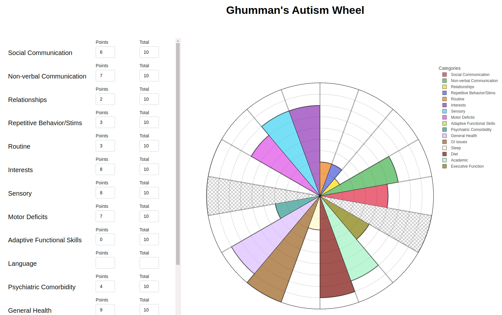

# Ghumman's Autism Wheel

This project helps you generate Ghumman's Autism Wheel. The interactive visualization is a Plotly Dash App.

## Installation Guide

First clone the package by running the following command:
```
git clone https://github.com/AzeemGhumman/ghumman-autism-wheel.git
```

To install dependencies, run:

```
pip install -r requirements.txt
```

To run the app locally, run the following command:

```
python app.py
```

Once the app is running, the visualization can be accessed here: `http://127.0.0.1:8050/`



### Reference

Dr. Usman Ghumman's website: https://www.usmanghumman.com/